# 🐾 PawPal+ — with an AI Pet Care Assistant

A pet-care planning app that builds a smart daily schedule for a busy owner, and
an **AI assistant** that turns a plain-English question
(*"I only have 20 minutes before work — what should I do for my pets?"*) into a
prioritized, reasoned care plan grounded in that owner's actual pets and tasks.

Built with Python, Streamlit, and the Google Gemini API.

---

## 📦 The Original Project (Modules 1–3)

**PawPal+** started as a system-first (UML → Python → Streamlit) scheduling app
for pet owners. Its original goal was to help a busy owner stay consistent with
pet care by tracking care tasks (walks, feeding, meds, grooming) for multiple
pets, then producing a **daily plan ordered by time and priority**, detecting
**scheduling conflicts**, and rolling **recurring tasks** forward automatically.
The core engine (`pawpal_system.py`) — `Owner`, `Pet`, `Task`, and the
`Scheduler` "brain" — was fully implemented and covered by automated tests before
any AI was added.

This repository is the **Module 4 extension**: it adds one major new capability —
an **AI Pet Care Assistant** — on top of that existing, unchanged engine.

---

## 📝 Title and Summary

**PawPal+ turns a pet owner's messy, real-life question into a concrete plan.**

The original app answers *"what's on my schedule?"*. The AI assistant answers the
harder, human question: *"given my constraints right now, what should I actually
do first?"* It reads the owner's real pets and pending tasks, respects a stated
constraint (like "20 minutes"), and returns an ordered plan **with reasoning** —
which tasks to do now, and what to safely defer.

**Why it matters:** it's a small but complete example of a *responsible* applied-AI
feature — one that is **grounded in real application data** (not a generic
chatbot), **guarded against failure** (empty input, missing data, and API errors
never crash the app), and **testable offline**. Those are the exact qualities that
make an LLM feature safe to ship in a real product.

---

## 🏗️ Architecture Overview

Data flows **input → process → output**, with humans and automated tests both
checking the AI's results:

```mermaid
flowchart TD
    %% ===== INPUT LAYER =====
    User([" Pet Owner (human) "])
    User -->|"adds pets & tasks"| UI["Streamlit UI (app.py)"]
    User -->|"natural-language request<br/>e.g. '20 min before work'"| UI

    %% ===== DATA STORE / BACKEND =====
    Backend["PawPal+ Backend (pawpal_system.py)<br/>Owner · Pet · Task · Scheduler"]
    UI <-->|"owner / pets / tasks"| Backend

    %% ===== AI MODULE =====
    subgraph AI["AI Pet Care Assistant (ai_pet_assistant.py)"]
        direction TB
        Guard{"GUARDRAILS<br/>empty input? no pets? no tasks?"}
        Retriever["RETRIEVER / Context Builder<br/>build_task_context()<br/>pending tasks + conflicts"]
        Agent["AGENT (LLM)<br/>Gemini generate_content()<br/>model: gemini-flash-latest"]
        Evaluator{"EVALUATOR<br/>API error? blocked? empty text?"}
    end

    %% ===== PROCESS FLOW =====
    UI -->|"user_request + Scheduler"| Guard
    Backend -.->|"grounding data<br/>(real pets & tasks)"| Retriever
    Guard -->|"invalid → safe message"| Output
    Guard -->|"valid"| Retriever
    Retriever -->|"grounded context + prompt"| Agent
    Agent --> Evaluator
    Evaluator -->|"failure → safe message"| Output
    Evaluator -->|"ok → care plan"| Output

    %% ===== OUTPUT LAYER =====
    Output["OUTPUT<br/>Care Plan / Status Message"]
    Output --> UI
    UI -->|"displays plan"| User

    %% ===== HUMAN + TESTING CHECKS =====
    User ==>|"reads plan, decides,<br/>marks tasks done"| HumanCheck["HUMAN-IN-THE-LOOP<br/>owner validates recommendation"]
    Tester["TESTER (pytest)<br/>test_ai_pet_assistant.py<br/>fake client · no network"]
    Tester ==>|"verify guardrails<br/>& data grounding"| AI
    Agent -.->|"counts & outcomes<br/>(no secrets)"| Logs["Logging (pawpal.ai)"]

    classDef human fill:#e8f4ff,stroke:#3b82f6,color:#111;
    classDef check fill:#fff4e6,stroke:#f59e0b,color:#111;
    class User,HumanCheck human;
    class Tester,Evaluator,Guard,Logs check;
```



*(Full source: [`diagrams/full_system.mmd`](diagrams/full_system.mmd).)*

**How to read it:**

| Component | In the code | Role |
|---|---|---|
| **Retriever** | `build_task_context()` | Pulls the owner's real pending tasks + conflicts from the `Scheduler` — this is what keeps it grounded, *not* a generic chatbot. |
| **Guardrails** | top of `generate_care_plan()` | Deterministic checks (empty input / no pets / no tasks) that answer *before* any API call. |
| **Agent** | one `client.models.generate_content()` call | Sends the grounded context + the owner's question to Gemini. |
| **Evaluator** | after the call | Catches API/network errors and blocked/empty responses, converting them to safe messages. |
| **Human-in-the-loop** | the owner | Reads the plan, decides, and marks tasks done — the human validates the AI. |
| **Tester** | `tests/test_ai_pet_assistant.py` | Verifies the guardrails and data-grounding with a fake client (no network). |

The AI logic lives in a **dedicated module** (`ai_pet_assistant.py`); the Streamlit
UI stays thin. That boundary is what made swapping the LLM provider a localized
change (see *Design Decisions*).

---

## ⚙️ Setup Instructions

**Requirements:** Python 3.9+ (3.10+ recommended).

**1. Create and activate a virtual environment**

```bash
python -m venv .venv
source .venv/bin/activate        # Windows PowerShell: .venv\Scripts\Activate.ps1
```

**2. Install dependencies**

```bash
pip install -r requirements.txt
```

**3. Add your Gemini API key** — get a free key from
[Google AI Studio](https://aistudio.google.com/apikey), then create a file named
`.env` in the project root:

```bash
# .env  (git-ignored — never commit this)
GEMINI_API_KEY=your-gemini-key-here
```

The app loads `.env` automatically via `python-dotenv`. **Without a key the rest of
PawPal+ still works** — the assistant simply reports that it isn't configured.

**4. Run it**

```bash
streamlit run app.py     # the web app (scheduler + AI assistant)
python main.py           # command-line demo of the scheduling engine
python -m pytest         # the automated test suite
```

Then, in the app: add a pet, add a couple of tasks, and ask the AI assistant a
question at the bottom of the page.

---

## 💬 Sample Interactions

All examples run against the built-in demo dataset (`python main.py` /
`build_demo()`): two pets — **Rex** (dog) and **Mochi** (cat) — with an
intentional 08:00 double-booking (Rex's *Morning walk* and Mochi's *Feed*). These
are **real, unedited outputs** from the Gemini-backed assistant.

### Example 1 — Time constraint

> **Input:** *"I only have 20 minutes before work. What should I do for my pets?"*

> **Output:**
> Here is your quick plan for the next 20 minutes:
> **What to do now:**
> 1. **Mochi** – Feed (10 min)
>
> **Reasoning:** Mochi's feeding is marked **URGENT** and easily fits within your
> 20-minute limit, resolving the 08:00 conflict.
>
> **What to defer:** Rex's *Morning walk* (30 min) exceeds your window — postpone
> it until after work. Rex's *Dinner* (18:00) and Mochi's *Litter cleanup* (20:00)
> remain scheduled for this evening.

✅ Notice it added up durations, respected the 20-minute budget, and used the real
priorities.

### Example 2 — Specific pet + conflict awareness

> **Input:** *"What does Rex need today, and is anything double-booked?"*

> **Output:**
> Yes, there is **one double-booking** at 08:00: **Mochi's Feed** (urgent, 10 min)
> conflicts with **Rex's Morning walk** (high, 30 min).
>
> Here is what **Rex** needs today:
> * **Morning walk** (08:00, High, 30 min)
> * **Dinner** (18:00, Urgent, 10 min)
>
> **Recommended order:** Mochi – Feed (08:00) → Rex – Morning walk (~08:10) →
> Rex – Dinner (18:00) → Mochi – Litter cleanup (20:00). Handle Mochi's quick,
> urgent feed first to clear the 08:00 clash, then head out for Rex's walk.

✅ It surfaced the conflict the `Scheduler` detected and reasoned around it.

### Example 3 — Unknown pet (guardrail via grounding)

> **Input:** *"What should I do for my parrot Kiwi this morning?"*

> **Output:**
> Hi Sam! You don't have a parrot named Kiwi listed in PawPal+ (your registered
> pets are **Rex** and **Mochi**). Here is your prioritized plan for your actual
> pets this morning… *(then a grounded plan for Rex and Mochi).*

✅ Because the prompt is grounded in the real pet list, the assistant refuses to
invent a pet and corrects the owner instead.

### Example 4 — Resilience (real API failure, handled)

During testing, Gemini returned a live **503 "high demand"** error. The assistant
did **not** crash — it logged the failure and showed:

> *"Sorry — I couldn't reach the AI assistant just now. Please check your
> connection or API key and try again."*

✅ Evidence the error-handling works against real-world failures, not just in tests.

---

## ✅ Reproducible Execution Evidence

Everything below is copied from **real runs** so the system can be graded without a
video. It demonstrates an end-to-end run, the AI feature behavior, and the
reliability/guardrail behavior — each input paired with its actual output. Demo
data throughout: owner **Sam** with **Rex** (dog) and **Mochi** (cat), including an
intentional 08:00 scheduling conflict (from `python main.py` / `build_demo()`).

### A. Automated tests

```text
$ python -m pytest -q
..................                                                       [100%]
18 passed in 0.04s
```

### B. End-to-end engine run (CLI)

```text
$ python main.py
Today's Schedule for Sam
========================================
08:00  [URGENT]  Mochi: Feed (10 min)
08:00  [HIGH  ]  Rex: Morning walk (30 min)
18:00  [URGENT]  Rex: Dinner (10 min)
20:00  [MEDIUM]  Mochi: Litter cleanup (15 min)

Heads up - 1 scheduling conflict(s):
  - Mochi: Feed (08:00) overlaps Rex: Morning walk (08:00)
```

### C. AI feature behavior — grounded, adaptive replies

Real replies from the Gemini-backed assistant. Note it **matches the answer to the
question** and stays grounded in the actual pets/tasks (it does not invent a pet):

```text
INPUT : "How many pets do I have?"
OUTPUT: You have 2 pets: Rex and Mochi.                        (direct data answer)

INPUT : "I have 20 minutes, what should I do?"
OUTPUT: Here is your 20-minute plan:
        1. Mochi | Feed | 10 min | 08:00
        Why this order: Mochi's feeding is URGENT and fits your 20-minute window.
        What to defer: Rex's Morning walk (30 min).           (plan + time budget)

INPUT : "What should I do for my parrot Kiwi?"
OUTPUT: You don't have a parrot named Kiwi listed in PawPal+
        (your registered pets are Rex and Mochi)...            (grounding, no hallucination)

INPUT : "How are you doing?"
OUTPUT: I'm doing great, thanks for asking! I'm here and ready
        to help you manage Rex and Mochi's care today.         (small talk, no forced plan)
```

### D. Reliability / guardrail behavior (deterministic — runs with no API key)

```text
[Empty input] input='   '
  status=empty_input
  reply=Tell me what you need — for example, "I have 20 minutes before work..."

[No pets] input='what should I do?'
  status=no_pets
  reply=There are no pets in PawPal+ yet. Add a pet first and I can help you plan their care.

[Over-long input] input='xxxx... (1001 chars)'
  status=too_long
  reply=That message is a bit long for me — please keep it under 1000 characters and try again.

[Medical/emergency] input='My dog is bleeding, help!'
  status=medical
  reply=⚠️ I'm a pet-care scheduling assistant, not a vet — I can't help with health
        problems or emergencies. Please contact your veterinarian right away...

[Escalating rate limit]
  1st send: allowed=True  cooldown=3s
  spam #1 : allowed=False -> wait ~6s  (cooldown grew to 6s)
  spam #2 : allowed=False -> wait ~12s (cooldown grew to 12s)
```

### E. AI/API error handling (real quota event)

During testing the Gemini **free-tier daily quota was exhausted**, so the API
returned HTTP `429 RESOURCE_EXHAUSTED`. The assistant caught it and returned a safe,
specific message instead of crashing:

```text
INPUT : "I have 20 minutes, what should I do?"   (while quota exhausted)
OUTPUT: The AI assistant has reached its free usage limit for now. Please wait a
        little and try again — the free quota resets over time (or add billing to
        your Gemini API key for higher limits).
```

**Coverage:** ✅ end-to-end run (A, B) · ✅ AI feature behavior (C) · ✅
reliability/guardrails (D, E) · ✅ clear output for every case.

---

## 🧠 Design Decisions & Trade-offs

| Decision | Why | Trade-off |
|---|---|---|
| **One LLM call — no RAG, no tools, no agents** | The relevant data (a handful of pets/tasks) is small and structured; it fits directly in the prompt. RAG or multi-agent orchestration would be over-engineering for this scope. | Won't scale to huge, unstructured histories — but that isn't this app's problem. |
| **Ground the prompt in existing `Scheduler` methods** | Reusing `upcoming_with_pets()` / `conflict_warning()` means the AI always sees the *same* data the rest of the app shows, making it data-dependent instead of a generic chatbot. | The assistant is only as good as the data the owner entered. |
| **Deterministic guardrails *before* the API call** | Empty input, no pets, and no tasks are cheap, predictable failure modes — answering them in code is faster, free, and never wrong. | Unknown-pet handling is left to the prompt (see Example 3) rather than hard-coded parsing, which would be brittle. |
| **Dependency-inject the AI client** | `generate_care_plan(..., client=...)` lets tests pass a fake client, so guardrails and grounding are verified **offline, with no API key or network**. | One extra optional parameter. |
| **`gemini-flash-latest` (a stable alias)** | A pinned model (`gemini-2.5-flash`) was retired mid-project and 404'd; the alias tracks the current Flash model so it won't break. | The alias can shift model behavior over time — acceptable for a demo. |
| **Secrets in `.env`, git-ignored, loaded via `dotenv`** | Keeps the API key out of source code and out of version control. | Each user must supply their own key. |
| **Log counts/outcomes, never content** | Records that a request happened and how it ended, without ever writing the raw request, the plan, or the key to logs. | Slightly less detail when debugging. |
| **AI in its own module; UI stays thin** | Modularity and testability — and it paid off when the project **switched providers from Anthropic Claude to Google Gemini**: only `ai_pet_assistant.py` changed, not the UI or engine. | A little more indirection than inlining it in `app.py`. |

---

## 🧪 Testing Summary

Reliability is proven three ways: **automated tests**, a **human-evaluation table**,
and **logging + error handling**.

### 1. Automated tests — `python -m pytest`

**12 / 12 pass.**

- **5 engine tests** (`tests/test_pawpal.py`): task completion, adding tasks,
  sorting by time, recurring tasks, conflict detection.
- **7 AI tests** (`tests/test_ai_pet_assistant.py`), all using a **fake client so no
  network or API key is needed**:
  - empty input, no pets, and no pending tasks are each handled without an API call
  - API/network errors are **caught, not raised** (the app never crashes)
  - blocked/empty model responses degrade to a safe message
  - `build_task_context()` renders the real pet/task data
  - the happy path proves the owner's **actual task data is sent to the model**

```text
$ python -m pytest -q
............                                                     [100%]
12 passed in 0.03s
```

### 2. Human evaluation (parseable results)

Each row was run against the demo dataset (Rex + Mochi, with an intentional 08:00
conflict) and the AI's output was checked by hand. Outputs are the real ones shown
in *Sample Interactions*.

| Test Input | Evaluation Criteria | Result |
|---|---|---|
| "I only have 20 minutes before work…" | Fits tasks in budget, prioritizes URGENT, explains reasoning | **Pass** — chose Mochi Feed (10 min), deferred Rex's 30-min walk |
| "What does Rex need today, and is anything double-booked?" | Lists only Rex's tasks; surfaces the 08:00 conflict | **Pass** — flagged Feed vs Morning-walk clash |
| "What should I do for my parrot Kiwi?" (unknown pet) | Does not invent a pet; corrects the owner | **Pass** — "you don't have a parrot named Kiwi… Rex and Mochi" |
| Empty input | Handled gracefully, no API call, no crash | **Pass** — prompts for a real question |
| No pets in system | Graceful message, no API call | **Pass** |
| No scheduled tasks | Graceful message, no API call | **Pass** |
| Live Gemini **503** ("high demand") | Error caught, safe message, no crash | **Pass** — safe fallback shown |
| Blocked / empty model response | Degrades to a safe message | **Pass** (unit-tested) |

### 3. Logging & error handling

Every AI action is logged via the stdlib `logging` module (logger `pawpal.ai`) —
request length, pet/task counts, model, and outcome — **never** the raw request,
the plan, or the API key. Every failure path (SDK/network/auth error, safety
block, empty response) is caught and converted to a safe user message.

### Summary

> **12 / 12 automated tests pass and 8 / 8 human-evaluation scenarios behaved
> correctly.** The assistant's main failure mode is *transient* Gemini `503`
> errors, which are caught and shown as a safe message instead of crashing.
> Grounding every prompt in the real `Scheduler` data kept all plans tied to the
> actual pets and tasks — including correctly refusing to invent an unlisted pet.

**What didn't work (and how it was handled):** the first model choice,
`gemini-2.5-flash`, returned **404 "no longer available to new users"** → switched
to the stable alias `gemini-flash-latest`. A live **503** during testing was caught
by the guardrail — an accidental but genuine test of the error path.

**What I learned:** model IDs get **deprecated** and cloud APIs **fail
transiently**, so an LLM feature must assume the call can fail and degrade
gracefully; **dependency injection** makes AI code unit-testable offline; and
keeping the AI in its own module made the **Claude → Gemini** provider swap a
small, low-risk change.

---

## 🤔 Reflection

Building this taught me that the *interesting* part of an applied-AI feature isn't
the model call — it's everything around it: grounding the prompt in real data so
the output is trustworthy, and wrapping the call in guardrails so failure is
boring instead of catastrophic. The single hardest lesson was that the API will
fail in ways you didn't plan for (a retired model, a 503), so "handle errors
safely" has to be designed in from the start, not bolted on.

> 📄 **The full graded responsible-AI reflection** — how I collaborated with AI,
> one helpful and one flawed AI suggestion, and the system's limitations — lives in
> [`model_card.md`](model_card.md).

### What this project says about me as an AI engineer

This project shows that I treat an LLM as one component inside a real system, not as
a magic box. Rather than bolting a generic chatbot onto the app, I grounded the
assistant in the application's actual data so every answer is tied to the user's real
pets and tasks, and I built the reliability layer that production AI needs —
deterministic guardrails for empty input, missing data, over-long or medical
requests, an escalating rate limit, and safe handling of API errors and quota
limits — all covered by an offline, dependency-injected test suite so the behavior
is *proven*, not assumed. When the model I chose was retired and my free-tier quota
ran out mid-project, I diagnosed the real causes and adapted (swapping providers and
models, surfacing clear error messages) instead of hiding the failures. I care about
the parts of AI engineering that decide whether a feature is trustworthy: grounding,
guardrails, graceful degradation, honest error reporting, and testing — and I can
integrate all of that into an existing codebase without breaking what already works.

---

## ✨ Scheduling Engine Features (original PawPal+)

The engine in `pawpal_system.py` (unchanged by the AI work) implements:

- **Sort by time, then priority** — `upcoming_tasks()` orders pending tasks by
  `scheduled_time`, breaking ties by priority (`URGENT → HIGH → MEDIUM → LOW`).
- **Conflict detection** — `conflicts()` treats each task as a window
  `[start, start + duration]` and reports overlaps with an efficient sweep (stops
  early once a later task starts after the current one ends).
- **Conflict warnings** — `conflict_warning()` turns overlaps into a readable
  message and never raises.
- **Same-time grouping** — `same_time_tasks()` flags strict double-bookings.
- **Daily & weekly recurrence** — `complete_task()` marks a task done and auto-queues
  its next occurrence.
- **Filtering** — `filter_tasks(completed=…, pet_name=…)` narrows by status and/or
  pet (case-insensitive, AND-combined).
- **Cross-pet views** — `all_tasks()`, `pending_tasks()`, `upcoming_with_pets()`.
- **Stable task identity** — every `Task` carries a `UUID`.

### Class Diagram (UML)

The `Scheduler` reads pets live from the `Owner`, which owns `Pet`s, which hold
`Task`s.


### Sample CLI output (`python main.py`)

```text
Today's Schedule for Sam
========================================
08:00  [URGENT]  Mochi: Feed (10 min)
08:00  [HIGH  ]  Rex: Morning walk (30 min)
18:00  [URGENT]  Rex: Dinner (10 min)
20:00  [MEDIUM]  Mochi: Litter cleanup (15 min)

Heads up - 1 scheduling conflict(s):
  - Mochi: Feed (08:00) overlaps Rex: Morning walk (08:00)
```

---

## 📁 Project Structure

```text
.
├── app.py                      # Streamlit web app (scheduler UI + AI assistant section)
├── ai_pet_assistant.py         # AI Pet Care Assistant: Gemini call, guardrails, logging
├── main.py                     # Command-line demo of the scheduling engine
├── pawpal_system.py            # Core classes: Owner, Pet, Task, Scheduler, enums
├── requirements.txt            # streamlit, pytest, google-genai, python-dotenv
├── .env                        # GEMINI_API_KEY (git-ignored — you create this)
├── model_card.md               # Responsible-AI reflection (graded — Step 5)
├── diagrams/
│   ├── full_system.mmd         # System architecture diagram (this feature)
│   ├── uml_final.mmd / .png    # Class diagram for the engine
│   └── uml_draft.mmd, architecture.mmd
└── tests/
    ├── test_pawpal.py          # Scheduler engine tests (5)
    └── test_ai_pet_assistant.py# AI assistant tests (7, no network)
```

---

*PawPal+ — a small, complete example of shipping an LLM feature responsibly:
grounded, guarded, and tested.*
